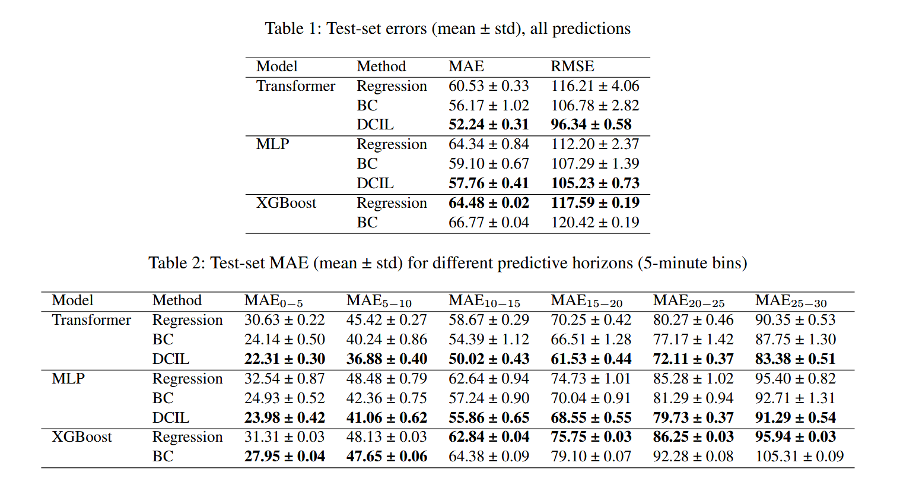

# Simulation-Driven Railway Delay Prediction: An Imitation Learning Approach

## Overview

This repository accompanies “Simulation-Driven Railway Delay Prediction: An Imitation Learning Approach” and contains the full data-engineering, simulation, and training stack described in the paper. It ingests three years of INFRABEL operational logs (January 2022 → December 2024), enriches them with station/line embeddings, builds snapshot datasets (≈255 k snapshots, 51 M train instances) via `src/data/*.py`, and pre-computes itineraries plus evaluation configs for fast Monte‑Carlo replay.

On top of these artifacts, `src/environment/simulation.py` provides a stochastic network simulator that can roll out multiple sampled trajectories of different snapshots in a GPU-parallelized fashion. Policies in `src/algorithms/{regression,bc,dcil}/` cover classic regressors, behavioural cloning, and the paper’s Drift‑Corrected Imitation Learning (DCIL), instantiated with Transformer, MLP, and XGBoost backbones (`src/models/`). The scripts under `src/slurm` and `src/scripts` reproduce every experiment, analysis plot, and table in the paper: the paper is fully reproducible end‑to‑end.


## Table of Contents
- [Installation](#installation)
- [Data Preparation](#data-preparation)  
- [Experiments](#experiments)  
- [Results](#results)
- [License](#license)

---

## Installation

### Prerequisites
- **Python**: 3.12.10  
- **Conda** (optional, but recommended) or a plain `venv`

### Using Conda

```bash
conda create -n rail-delay-pred python=3.12.10
conda activate rail-delay-pred
pip install --upgrade pip
pip install -r requirements.txt
```

## Data Preparation

### Download raw data:
Run the following to fetch the raw data for the period January 2021 through December 2025 (having the month before and after is necessary for simulation):

```bash
python -m src.data.download_raw_data 'data/raw' 2021 12 2025 1
```

### Process raw data
Submit the SLURM job to process your downloaded files

```bash
sbatch src/slurm/data_creation/raw_data_processing.slurm
```

### Create embeddings
Create the embeddings for stations and lines
```bash
python -m src.data.station_embedding 'data/raw' 'data/embeddings' 2021 12 2025 1 8
python -m src.data.line_embedding 'data/raw' 'data/embeddings/stations_emb_8.pkl' 'data/embeddings' 2021 12 2025 1
```

### Create dataset files
Create the dataset files (configs, data, metadata)

```bash
sbatch src/slurm/data_creation/create_dataset.slurm
```

### Create itineraries
Create the itineraries files (used to make the simulator fast)

```bash
sbatch src/slurm/data_creation/create_itineraries.slurm
```

### Create eval config
Create the eval configuration

```bash
python -m src.data.create_eval_config 'data/eval_configs/cfg.pkl' 30 50 --horizon-obs-bins 0 5 10 15 20 25 30 --delay-delta-bins -5 0 5
```

## Experiments

Now, you can run the experiments:

### Running hyper-parameter tuning

Transformer regression
```bash
sbatch src/slurm/experiments/tr_reg/tr_reg_phase1.slurm
sbatch src/slurm/experiments/tr_reg/tr_reg_phase2.slurm
```

Transformer BC
```bash
sbatch src/slurm/experiments/tr_bc/tr_bc_phase1.slurm
sbatch src/slurm/experiments/tr_bc/tr_bc_phase2.slurm
```

Transformer DCIL
```bash
sbatch src/slurm/experiments/tr_dcil/tr_dcil_phase1.slurm
sbatch src/slurm/experiments/tr_dcil/tr_dcil_phase2.slurm
sbatch src/slurm/experiments/tr_dcil/tr_dcil_phase3.slurm
```

MLP regression
```bash
sbatch src/slurm/experiments/mlp_reg/mlp_reg_phase1.slurm
sbatch src/slurm/experiments/mlp_reg/mlp_reg_phase2.slurm
```

MLP BC
```bash
sbatch src/slurm/experiments/mlp_bc/mlp_bc_phase1.slurm
sbatch src/slurm/experiments/mlp_bc/mlp_bc_phase2.slurm
```

MLP DCIL
```bash
sbatch src/slurm/experiments/mlp_dcil/mlp_dcil_phase1.slurm
sbatch src/slurm/experiments/mlp_dcil/mlp_dcil_phase2.slurm
sbatch src/slurm/experiments/mlp_dcil/mlp_dcil_phase3.slurm
```

XGBoost regression
```bash
sbatch src/slurm/experiments/xgb_reg/xgb_reg_phase1.slurm
sbatch src/slurm/experiments/xgb_reg/xgb_reg_phase2.slurm
```

XGBoost BC
```bash
sbatch src/slurm/experiments/xgb_bc/xgb_bc_phase1.slurm
sbatch src/slurm/experiments/xgb_bc/xgb_bc_phase2.slurm
```

If you would like to visualize the runs (plots and best runs tables) of a tuning phase, you can run for instance:

```bash
python -m src.scripts.analyze_experiments "runs/tr_dcil/tuning_phase_3" "mae,hor0,hor1,hor2,hor3,hor4,hor5" "mae" figs/tr_dcil_p3_figs.pdf --param_groups "alpha,beta;traj_len"
```

For args details, see implementation.

### Running final evaluations on test set

Run the following to reproduce the final experiments for the Table 1 and 2.

```bash
sbatch src/slurm/experiments/tr_reg/tr_reg_final.slurm
sbatch src/slurm/experiments/tr_bc/tr_bc_final.slurm
sbatch src/slurm/experiments/tr_dcil/tr_dcil_final.slurm
sbatch src/slurm/experiments/mlp_reg/mlp_reg_final.slurm
sbatch src/slurm/experiments/mlp_bc/mlp_bc_final.slurm
sbatch src/slurm/experiments/mlp_dcil/mlp_dcil_final.slurm
sbatch src/slurm/experiments/xgb_reg/xgb_reg_final.slurm
sbatch src/slurm/experiments/xgb_bc/xgb_bc_final.slurm
```

### Creating tables

Create the table (copy latex code from terminal out).

```bash
python -m src.scripts.create_tables
```

### Creating uncertainty quantification plot

Run this to reproduce the uncertainty quantification plot (specifiy your run path and checkpoint number)

```bash
python -m src.script.uncert_quant "YOUR_RUN_PATH" "YOUR_CHECKPOINT_NUMBER" 'data/dataset' 'data/itineraries' 'data/eval_configs/cfg.pkl' 'figs/uncertainty_quantification.svg' 1.0
```

## Results

The test-set results from the paper (Section 7, Tables 1–2). Metrics are in seconds and averaged over 10 seeds (mean ± std).




## License

This project is licensed under the [MIT License](LICENSE.txt).
